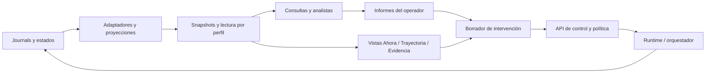

# SPEC · Consola de investigación: observar, reconstruir, consultar e intervenir

Estado (04/10/2026): **propuesta, sin implementar**. Basada en la consola y el visor existentes; el equipo y su tablón dependen de [SPEC-INVESTIGACION-PARALELA](SPEC-INVESTIGACION-PARALELA.md).

Contratos relacionados: [orquestación](SPEC-ORQUESTADOR.md), [investigador asistido](SPEC-INVESTIGADOR-ASISTIDO.md), [objetivo y validación](SPEC-OBJETIVO.md) y [auditoría del método](SPEC-AUDITORIA-METODO.md). Las extensiones propuestas a sus políticas se señalan aquí; este documento no las modifica silenciosamente.

## 1. Propósito y decisión de producto

Un operador necesita entender una investigación como un proceso: qué está haciendo cada investigador, por qué se abrió una rama, quién recibió una hipótesis, qué prueba la cambió y qué costó llegar hasta aquí. Una lista de logs por run deja de ser suficiente cuando aparecen seniors, ramas, proyectos y equipos.

Se propone ampliar la consola local existente con **tres vistas del mismo registro**:

1. **Ahora:** actividad y coordinación en curso.
2. **Trayectoria:** historia temporal y relaciones entre investigaciones.
3. **Evidencia:** hipótesis, experimentos, modelos y sus referencias.

Un panel de **consulta en texto** acompaña las tres. El operador también puede encargar a un **analista del registro** una investigación sobre lo que el equipo ha investigado, con tarea, fuentes, journal y presupuesto propios. Puede enviar mensajes y gobernar la ejecución por los mecanismos existentes.

La unidad de navegación es un **espacio de investigación**: un run, un proyecto o, cuando exista, un equipo. Agrupar runs para verlos juntos no los convierte en equipo ni les concede comunicación.

### Preguntas que debe resolver la interfaz

- ¿Quién está trabajando, esperando una respuesta, comprobando un modelo o esperando al operador?
- ¿Qué evidencia llevó a abandonar una hipótesis o recuperar un modelo anterior?
- ¿Qué trabajo heredó esta rama y qué hizo después por su cuenta?
- ¿Qué publicó otro investigador, quién lo abrió y dónde se citó?
- ¿El mensaje del senior llegó antes o después del experimento relevante?
- ¿Qué sabemos según estos registros y qué sigue siendo una hipótesis?
- ¿Cuánto pagó la investigación y cuánto gastó el operador en comprenderla?

El MVP no exige que la investigación paralela esté implementada: empieza por proyectos, runs y seniors actuales. No introduce por sí solo un nuevo criterio de éxito ni cambia el método del investigador.

## 2. Base existente y diferencias

| Pieza actual | Uso propuesto | Lo que falta |
|---|---|---|
| `lib/src/runtime/console.ts` | Servidor local, listado, seguimiento, mensajes, lanzamiento y proyectos | Vista conjunta, relaciones, consultas y sesiones de análisis |
| `lib/src/runtime/control.ts` | Estado, heartbeat, órdenes, acuses, inicio y reanudación | IDs de órdenes idempotentes en la nueva API; entrega diferenciada de aceptación |
| `lib/src/orchestra/project.ts`, `batch.ts`, `launch.ts` | Proyectos, lotes, ramas, presupuestos y decisiones | Proyección común de sus entidades y costes |
| `lib/src/view/synthesis.ts`, `page.ts`, `animate.ts` | Momentos, creencias, modelos y visualización de episodios | Consulta por corte temporal, navegación entre runs y linaje entre ramas |
| `journal-viewer.html` | Visor histórico exportable | Exportación de un espacio completo, sin controles vivos |
| `learn/assisted/record.ts`, `experience.ts`, `orchestra/view.ts` | Lectores y vistas restringidas | Un contrato de lectura fiel compartido, filtrado por rol y corte |
| `ReplayLog` y journals | Historia y reproducción | Referencias estables entre procesos, snapshots y registro de nuevas órdenes |
| `audit/` | Auditoría posterior del método | Presentación de cobertura, limitaciones y versiones; no se presupone calibración completa |
| `team@1`, `publish`, `peers` | Equipo y comunicación | **Propuestos** en el spec paralelo; no se presentan como existentes |

La consola actual sigue un run por polling y expone eventos resumidos. El visor ya reconstruye momentos y creencias. Se reutilizan sus representaciones donde sean correctas; no se usa un resumen de una línea como sustituto de la evidencia original.

El lector de experiencia actual exige runs terminados. El analista de registros vivos necesita un adaptador de snapshots propio sobre los mismos datos permitidos; no se elimina esa precondición de `experience` para habilitar la consola.

## 3. Principios

- **C1. El registro manda.** Estado, costes y relaciones verificables se derivan de eventos. Las interpretaciones del LLM se etiquetan como tales y enlazan sus fuentes.
- **C2. Observar no interviene.** Abrir la consola, mover el cursor temporal o consultar no añade mensajes ni herramientas al investigador.
- **C3. Coste y ayuda son dimensiones distintas.** El operador puede pagar un análisis aparte. Si comparte su resultado, eso es ayuda externa y queda registrado aunque no se descuente de la bolsa de investigación.
- **C4. El pasado se consulta como pasado.** Un corte histórico no usa creencias, resultados ni explicaciones conocidos después.
- **C5. Una relación tiene un significado.** Heredar un historial, recibir un mensaje, citar una hipótesis y validar un modelo son relaciones diferentes. Cercanía temporal no demuestra influencia.
- **C6. La política vive en el servidor.** El puro no recibe ayuda. Los roles que ayudan no reciben verdad oculta, auditorías del operador ni resultados de examen no divulgados. Ocultar un botón no constituye aislamiento.
- **C7. Cada acción tiene destino, autor y acuse.** «Enviado», «aceptado por el arnés», «incluido en la pregunta al investigador» y «citado después» no son sinónimos.
- **C8. El trabajo sigue sin la pestaña.** Cerrar o desconectar el navegador no detiene runs ni analistas. Reconectar recupera la vista sin duplicar órdenes.
- **C9. Lo desconocido se muestra como desconocido.** No se inventan duración, coste, actividad actual, causalidad ni referencias para journals antiguos.
- **C10. No se exige un LLM para observar.** Las vistas, filtros, búsqueda literal y acciones explícitas funcionan sin consultas generativas.

## 4. Organización visual

### 4.1 Marco común

- Cabecera: objetivo, condición experimental, estado, última actualización y bolsas de presupuesto.
- Navegación izquierda: proyecto/equipo, ramas, runs, seniors y análisis del operador. Los análisis aparecen en un grupo separado.
- Centro: Ahora / Trayectoria / Evidencia, manteniendo selección y filtros.
- Inspector derecho: evento o entidad seleccionada, datos originales, procedencia, enlaces y acciones disponibles.
- Panel de consulta plegable: pregunta, fuentes seleccionadas, corte temporal y presupuesto de consulta.

La interfaz usa nombres legibles y conserva los IDs al abrir detalles. El estado no depende sólo del color. Las relaciones tienen texto accesible; una tabla ofrece alternativa al grafo. Los eventos extensos se abren bajo demanda.

```text
Proyecto: descubrir la ley       [En curso]    Investigación | Operador | Total
Runs y ramas          Ahora · Trayectoria · Evidencia             Inspector
  Junior A            A: ejecuta experimento en mundo e1          Hipótesis h7
  Junior B            B: espera respuesta del modelo              Evidencia...
  Senior              Senior: mensaje pendiente para A            Mensaje...
Análisis del operador Mensajes recientes y estado por destinatario Referencias...
  Analista 1
                     Consultar este espacio [hasta: Ahora]
```

### 4.2 Ahora: situación operativa

Una fila o tarjeta por actor, con:

- papel, modelo, tarea, mundo/lugar y condición;
- estado del proceso: en curso, deteniéndose, terminado, interrumpido o sin datos recientes;
- actividad observada: consulta al modelo, instrumento, check, reflexión, lectura del tablón, espera de ventana o aprobación;
- ronda y paso, última acción completada y tiempo desde ese evento;
- hipótesis/tarea actual **según el último texto registrado**, con cita;
- consumo, reserva y límite; mensaje pendiente más antiguo si lo hay.

La actividad precisa requiere eventos de inicio y fin. Donde no existan, se muestra «Último evento: ...; proceso activo», nunca «está razonando sobre X» por inferencia. No se promete acceso al razonamiento interno del modelo.

Un flujo de mensajes permite filtrar humano, senior, planificador y compañeros. Seleccionar uno ilumina sus destinatarios y su entrega; no dibuja adopción sin una cita o actualización explícita.

Señales operativas: heartbeat vencido, error de herramienta, presupuesto agotado, aprobación pendiente, orden rechazada. Las señales de atasco existentes se muestran con sus recuentos; no se convierten automáticamente en diagnósticos de mala investigación.

Mientras el operador lee contenido anterior, la vista no lo desplaza. Aparece «n eventos nuevos». Volver a «Ahora» es una acción explícita.

### 4.3 Trayectoria: tiempo y ramificaciones

Dos representaciones coordinadas dentro de esta vista:

- **Carriles temporales:** uno por investigador y por senior/planificador; carril separado de intervención humana y análisis del operador. Tiempo de reloj como eje común; rondas como marcas locales, nunca alineadas como si fueran simultáneas.
- **Linaje de investigaciones:** árbol de origen de ramas, más enlaces de mensajes y citas bajo demanda. El flujo de mensajes es un grafo; no se fuerza a un árbol.

El zoom cambia entre proyecto → ronda → evento. Los tipos de evento se filtran sin borrar el contexto. Se puede pedir «mostrar la trayectoria de esta hipótesis» o «mostrar las ramas que partieron de este modelo».

Relaciones explícitas:

| Relación | Evidencia necesaria |
|---|---|
| `continued_from` / `forked_from` | Run padre y corte exacto del historial |
| `supervises` / `scheduled_by` | Configuración o decisión del orquestador |
| `published` / `delivered` | Publicación y acuse de entrega |
| `opened` / `cited` | Lectura registrada / referencia escrita |
| `tested_by` | Petición y resultado referidos |
| `revised_after` | Cambio de creencia y justificación registrada |
| `validated_by` | Veredicto del protocolo para ese modelo |

Un enlace `revised_after` describe secuencia y justificación declarada; no prueba por sí mismo causalidad. Una hipótesis «parecida» detectada por un analista se dibuja como relación sugerida, con fuente y sin fusionar identidades.

Las anotaciones del humano se guardan en un registro del operador, con fecha y referencias. Comentar un evento no modifica el cuaderno del investigador ni le entrega ese comentario. «Enviar como mensaje» es una acción distinta.

**Trayectoria por rondas** (implementada, 04/10/2026). Encima de los carriles hay una tira por run, leída sólo de sus
eventos tal como los da el corte. Cada ronda es una columna con:

- **El check.** Barra con lo que puntuó 1 de cuántos; un mundo que no da puntuación por punto muestra sólo «sí» o «no», sin
  inventar nada. Debajo, `↓N`: episodios que empeoraron al repetirse. Encima, `✓` si se aceptó.
- **El modelo.** `●` es un modelo nuevo y `○ = rN` la vuelta a un modelo ya propuesto; si el evento no trae huella, se
  calcula de cómo está escrito el modelo. `◇` marca una reflexión.
- **Los pasos por tipo:** experimentos, observaciones y lecturas de registro.
- **Las creencias:** `+` nuevas, `~` revisadas, `−` abandonadas.
- **Marcadores arriba:**
  - `✉` un mensaje del operador, en la ronda a la que llegó;
  - `↺rN` el rejuego del modelo de la ronda N (el backtracking);
  - una línea discontinua cuando se añadieron rondas a un run terminado (perfil del operador).

Al pulsar una ronda se abren sus eventos en el inspector. Una tabla plegable da los mismos datos sin gráfico. Los
carriles quedan plegados debajo.

**Reanudación y ramas:** el prefijo heredado aparece plegado y referido al original; el tramo nuevo aparece separado. Un replay del modelo r8 dentro del mismo run es recuperación de un modelo, no creación de una rama. La vista muestra qué modelo se ejecutó y cuál se propuso después.

### 4.4 Evidencia: seguir una idea

Lista de hipótesis, modelos, experimentos y publicaciones, con filtros por mundo, autor, rama, fecha, estado y procedencia. Cada entidad tiene versión y referencia estable.

Una hipótesis muestra en orden: formulación, evidencia citada, pruebas asociadas, revisiones y estado declarado. «Confirmada por el investigador» se distingue de «modelo validado por el protocolo». Una creencia de un run no se declara universal por aparecer en varios cuadernos.

Abrir un experimento muestra petición y respuesta reales, incluyendo negativas y errores. Tablas, tableros y trayectorias usan adaptadores de presentación de cada laboratorio. Existe siempre una vista estructurada genérica; no se acopla la consola a grid.

Comparar dos modelos o hipótesis conserva ambos textos, resultados, mundo y condiciones. Las diferencias mecánicas y las explicaciones del analista se presentan separadas.

La auditoría del método aparece como una capa **posterior**, con fecha, versión, cobertura y estado de calibración. Si falta una auditoría no hay una nota implícita de cero. Una auditoría calculada hoy sobre un evento de ayer no se presenta como conocimiento disponible ayer.

## 5. Consultar con texto

### 5.1 Consultas rápidas

Ejemplos:

- «¿Qué están haciendo A y B y cuánto les queda?»
- «¿Por qué se abrió la rama B?»
- «¿Qué pasó después del mensaje del senior sobre h7?»
- «¿Quién leyó esta publicación y quién la citó?»
- «¿Qué sabíamos al terminar la ronda 6 de A?»
- «¿Qué hipótesis descartadas volvieron a aparecer?»

El panel declara el alcance: espacio, runs, intervalo, perfil de lectura y snapshot. «Ahora» captura un corte al enviar la pregunta; la respuesta indica «hasta este corte», aunque el equipo avance durante la consulta. Un snapshot de varios runs es un vector de posiciones por flujo, no una ficción de lectura simultánea.

Las preguntas de estado, conteos y costes se resuelven con consultas estructuradas cuando sea posible. Para síntesis libre, un LLM usa herramientas de lectura sobre ese mismo snapshot. No recibe el repositorio completo ni acceso arbitrario a archivos, red, consola de control o credenciales.

La respuesta separa:

- hechos extraídos del registro, con enlaces a eventos;
- interpretación o hipótesis del analista, con apoyo y límites;
- información ausente o contradictoria.

Cada afirmación factual relevante debe tener una referencia abrible. El servidor comprueba que existe y pertenece al alcance; eso no certifica que la interpretación sea correcta. Si no hay evidencia, la respuesta lo dice. El registro de la consulta conserva pregunta, fuentes efectivamente leídas, respuesta, modelo, uso y errores.

Las consultas no ejecutan experimentos. «Manda esto a B» genera un borrador de acción en un compositor separado; no se convierte en una orden durante una respuesta informativa. Escribir y pulsar «Enviar» en ese compositor ya es la instrucción del operador, sin un segundo diálogo para mensajes rutinarios.

### 5.2 Alcance e historial de la consulta

El corte temporal restringe también índices, resúmenes, memoria y resultados de búsqueda. Cambiar el cursor al pasado crea un contexto de consulta nuevo: una conversación que ya vio el futuro no puede responder como si lo ignorase.

Los textos del journal se tratan como datos. Un mensaje registrado que diga «ignora tus instrucciones» no autoriza acciones del asistente de consulta.

El streaming de texto es opcional; citas y estado de finalización permanecen verificables. Cancelar una consulta registra su consumo ya realizado; una reconexión no vuelve a lanzarla.

## 6. El analista del operador: investigar la investigación

### 6.1 Un encargo persistente, no otro junior por defecto

El operador selecciona «Nuevo análisis», escribe una tarea, elige fuentes y fija un presupuesto independiente. Ejemplo:

> Revisa las ramas A, B y C hasta este punto. Encuentra hipótesis que descartaron con evidencia insuficiente, compara sus contraejemplos y señala preguntas abiertas. Cita los experimentos originales.

El analista puede formular hipótesis sobre el proceso, contrastarlas con registros, buscar contraejemplos y producir un informe. No accede a `act`, `replay` o mundos de examen: su objeto de investigación es el registro. Si hace falta experimentar, propone una tarea de laboratorio y el operador la lanza como un run distinto con presupuesto y condición propios.

Formato propuesto `analysis@1`: tarea, perfil, alcance, snapshots, modelo, presupuesto, lecturas, notas, hipótesis del análisis, conclusiones citadas, preguntas abiertas, coste y estado. Journal y replay propios. El resultado no es un finding de ley validada.

Dos modalidades:

- **Corte fijo** (predeterminada): analiza un snapshot inmutable y termina al cumplir el encargo, agotar presupuesto o no poder avanzar.
- **Seguimiento** (explícito): incorpora nuevos snapshots por lote de eventos o intervalo mínimo, dentro del presupuesto. Conserva versiones del informe y registra qué cambió. No llama al LLM por cada heartbeat.

Puede trabajar sobre un run vivo. Esto es análisis del operador, **no** ejecutar anticipadamente la auditoría normativa `method_audit@1`, que conserva su contrato posterior al run.

### 6.2 Dos perfiles de lectura

| Perfil de análisis | Qué lee | Destino de sus resultados |
|---|---|---|
| **Registro de investigadores** | Lo observado y escrito en los runs autorizados, hasta el corte; sin verdad oculta ni auditorías privadas | Operador; puede preparar una aportación compartible bajo la política de ayuda |
| **Auditor del operador** | Además, verdad disponible, medidas privadas y auditorías posteriores permitidas | Sólo operador; sin instrumentos de envío ni exportación directa como ayuda |

Un analista no cambia de auditor a colaborador conservando contexto. Se crea una sesión nueva con fuentes autorizadas. Las notas y resúmenes derivados conservan la restricción de sus fuentes; quitar una cita no limpia su procedencia.

**Extensión explícita de Q2 del spec de orquestación:** un analista que ve varios registros puede saber más que cada miembro individual. Compartir su síntesis entre runs sólo se permite en una condición que autorice esa ayuda colectiva. No se habilita por el simple hecho de que todos sean asistidos. Para un senior individual sigue vigente el alcance del junior.

Leer un equipo completo no publica automáticamente sus notas privadas. Cuando el operador comparte una síntesis, se registra como **intervención del operador**, con referencias al análisis, y no se atribuye falsamente a una publicación voluntaria de un miembro.

### 6.3 Compartir una conclusión

El operador selecciona un pasaje, abre un borrador y elige destinatarios. Antes de enviar se ve texto exacto, procedencia, política aplicable y momento previsto de entrega. El sistema registra `derived_from: analysis/event`, autor humano y autor analítico original.

- En condición individual sin comunicación, no se ofrece el envío transversal; se propone una rama con condición de ayuda declarada.
- En equipos con ventanas, la ayuda derivada de otros miembros espera a la ventana correspondiente. Una condición práctica puede permitir entrega inmediata, pero debe declararlo; no se presenta luego como el experimento de ventanas cerradas.
- Un análisis con fuentes de operador no puede enviarse por esta ruta.
- Una intervención manual libre conserva su texto y autor. El sistema no puede comprobar todo lo que una persona sabe ni demostrar que nunca vio la verdad oculta. La interfaz ofrece declarar esa exposición y el resultado se etiqueta como ayuda humana, sin prometer pureza que no puede verificar.

## 7. Acciones y entrega de mensajes

### 7.1 Acciones disponibles

Consultar, iniciar run/proyecto/análisis, detener, reanudar, crear rama elegible, enviar mensaje, cambiar foco, permitir fuente y aprobar/rechazar un plan. Crear equipo y publicar en su tablón sólo cuando exista el soporte del spec paralelo.

La interfaz obtiene capacidades del servidor por entidad y estado. No anuncia una pausa instantánea: hoy hay parada y reanudación derivada. No anuncia bifurcación desde cualquier instante: inicialmente sólo desde finales/cortes soportados por el runtime. Otros puntos pueden seleccionarse para leer, pero no necesariamente para ejecutar desde ellos.

Crear una rama exige padre, corte, tarea o alternativa, investigador, condición y presupuesto. El resumen de lanzamiento muestra qué historia se hereda, qué mensaje inicial se incorpora y qué conocimiento externo se añade.

### 7.2 Ciclo de una orden

`borrador → encolada → aceptada por el arnés → entregada al investigador`, o `rechazada`, `cancelada antes de entrega`, `sin entrega al terminar`. Los estados no soportados todavía requieren nuevos eventos; no se deducen sólo del paso del tiempo.

Para una parada, el último estado es «ejecución terminada»; no hay entrega al modelo. Para un mensaje, «entregado» significa incluido en una pregunta registrada al investigador, no comprendido ni obedecido. «Citado después» es una relación adicional.

Enviar al equipo fija una lista de destinatarios al pulsar Enviar, con una orden hija por miembro y una clave de envío común. Se informa de aceptaciones y rechazos parciales; no hay entrega atómica ficticia. Las ramas creadas después no reciben retrospectivamente el mensaje.

Las órdenes pendientes durante replay esperan al tramo vivo, respetando el comportamiento existente. Si el run termina antes, quedan marcadas sin entrega. Reanudar no reenvía automáticamente una intervención que el operador no destinó a esa continuación.

Al operar desde un corte histórico, el compositor muestra claramente que la orden afectaría al estado **actual** del run. No se escribe «en el pasado». Una acción que quiera otro pasado necesita una rama soportada y explícita.

## 8. Presupuestos y contabilidad

Tres cifras visibles, desglosadas por tokens, llamadas a Jev y dinero cuando haya precio conocido:

1. **Investigación:** runs, experimentos, checks y coordinación perteneciente a su condición.
2. **Operador:** consultas, análisis y auditorías que encarga para comprender o evaluar.
3. **Total operativo:** suma de gastos efectivos de ambas bolsas, sin duplicar partidas.

Abrir vistas, buscar literalmente y filtrar no consume presupuesto de modelos. Las consultas generativas y los análisis reservan presupuesto del operador antes de lanzar llamadas. Una consulta sin presupuesto disponible puede seguir usando búsqueda estructurada.

Cada gasto lleva un ID único de operación y un pagador. Reserva, consumo confirmado y saldo se contabilizan en el servidor, evitando que dos analistas gasten la misma disponibilidad. Tokens de entrada/salida y caché se conservan cuando el proveedor los devuelve; coste desconocido se muestra como desconocido, no cero. Los límites por tiempo y el coste monetario estimado se distinguen de un límite exacto de tokens.

Si se entrega una conclusión analítica a un investigador, **el pagador no cambia retroactivamente**. Se registra además la ayuda externa y se enlaza el coste del análisis que la produjo, sin sumarlo dos veces. Una comparación experimental debe informar esa asistencia; no puede presentar ese trabajo como una mejora gratuita dentro de B.

Las ramas separan coste heredado, coste nuevo y coste efectivo del proyecto. El prefijo reproducido no vuelve a contarse como gasto de proveedor, aunque sí consuma tiempo local. Una respuesta servida desde replay no es otra compra de tokens.

Presupuesto separado no garantiza aislamiento de recursos: si analista e investigadores comparten GPU o endpoint, pueden competir. Las consultas del operador usan concurrencia limitada y menor prioridad donde el scheduler lo permita; se registra esa configuración y no se promete ausencia de impacto en latencia.

## 9. Modelo de datos, tiempo y procedencia

### 9.1 Entidades y eventos normalizados

IDs estables para espacio, proyecto, equipo, run, segmento de ejecución, actor, mundo, modelo, hipótesis, publicación, orden y análisis. Hipótesis `h1` de A y `h1` de B son distintas; los IDs locales se califican por su origen.

Sobre los journals se construye una proyección versionada, sin sustituirlos. Sobre de evento propuesto:

```ts
type ConsoleEvent = {
  schema: "research_event@1";
  id: string;
  source: { entity: string; generation: string; sequence: number; ref: string };
  recordedAt: string | null;
  observedAt: string;
  actor: string | null;
  type: string;
  round?: number;
  step?: number;
  causes: string[];
  references: string[];
  visibility: "researcher" | "operator";
  payloadRef: string;
};
```

`visibility` es clasificación de datos, no autorización suficiente: importa también el actor, el destinatario, el alcance y el corte. `causes` contiene vínculos operativos demostrables (una orden produjo una entrega); las asociaciones analíticas viven aparte.

El orden por secuencia de cada flujo es autoritativo. El reloj sirve para visualización entre flujos, no para inventar causalidad. Eventos tardíos se insertan sin invalidar los IDs. En journals antiguos se puede derivar identidad de archivo/generación/posición y hora de inicio + tiempo relativo cuando exista, indicando que es derivada.

### 9.2 Snapshots

Un snapshot guarda versión del índice, posiciones por flujo, hashes de los prefijos incluidos y perfil de lectura. Los prefijos o una copia inmutable de sus datos deben seguir disponibles durante la retención del análisis: un hash solo no permite reconstruirlos.

Los cortes usados para responder incluyen sus dependencias causales. Si falta un evento referenciado, el snapshot queda incompleto y la respuesta lo indica. No se usa un finding final para contestar sobre una ronda anterior. El detalle de una referencia y su exportación respetan el mismo corte que la búsqueda.

La vista distingue fecha del hecho, fecha de registro y fecha de interpretación. Puede mostrar un comentario posterior sobre un evento antiguo, pero no dentro de «lo que se sabía entonces».

### 9.3 Nuevos eventos mínimos

Además de adaptar los existentes, harán falta: inicio/fin de actividad con ID de operación; aceptación y entrega correlacionadas de mensajes; relación padre/corte de una rama; reservas y gastos; snapshots y lecturas de analistas; inicio/fin/cancelación de análisis; y, cuando exista equipo, publicación/versión/apertura del tablón.

No se graba un segundo «resultado científico» en la consola. Las nuevas entidades de UI referencian los resultados del runtime.

## 10. Arquitectura de implementación



### 10.1 Extender, no reemplazar el runtime

Ampliar `serveConsole` y extraer su frontend a módulos bajo `view/` o una carpeta de consola equivalente, reutilizando los renderizadores del visor. Mantener el visor HTML offline para compartir resultados.

Separar cuatro módulos: adaptación de journals, proyección/consulta, acciones de control y cliente visual. UI y analista consultan el mismo servicio de evidencia; el analista no puede usar las rutas de mutación.

Al inicio basta polling incremental con cursor estable. Para muchos actores, añadir SSE de eventos normalizados con reconexión desde cursor; no requiere WebSocket para cada herramienta. La primera carga combina snapshot y cursor sin huecos ni duplicados. Los errores de lectura de un archivo mientras se escribe no borran la vista: se conserva la última versión válida y se marca retraso.

Rutas propuestas, adicionales a las actuales:

| Operación | Contrato |
|---|---|
| Leer espacio y capacidades | Entidades, relaciones, estados y acciones permitidas |
| Leer eventos desde cursor / suscribirse | Páginas o SSE con IDs estables |
| Crear snapshot / abrir referencia | Corte verificable y datos autorizados |
| Consultar | Pregunta, snapshot, perfil y límite de gasto |
| Iniciar/seguir/detener análisis | Tarea persistente y bolsa del operador |
| Preparar/enviar orden | Payload tipado, destinatarios, procedencia e idempotency key |
| Exportar | Snapshot y perfil explícitos; sin credenciales ni controles vivos |

Cada acción valida estado y política en el servidor al ejecutarse. El cliente incluye la revisión que vio; si cambió de forma relevante, recibe conflicto con el estado actual. Reintentar la misma clave devuelve la misma orden, no otra publicación ni otro run. El despacho usa un registro duradero de órdenes y reconciliación con los acuses; no promete ejecución «exactamente una vez» por simple envío HTTP.

Mantener servicio local por defecto, comprobar origen en mutaciones y usar un token de sesión para comandos. Los nombres de entidad se resuelven en un catálogo; no se aceptan rutas arbitrarias. Credenciales permanecen en el servidor. Los fragmentos y código de modelos se renderizan como datos, nunca como HTML o JavaScript ejecutable en el navegador. Esto continúa las restricciones de la consola local; no introduce un servicio público multiusuario.

### 10.2 Genericidad

Los eventos y acciones comunes no contienen conceptos de piezas, fuerzas o Blender. Cada laboratorio puede aportar un renderizador de evidencia; una tabla/JSON legible es el fallback. Un laboratorio nuevo puede aparecer sin implementar un frontend específico.

Los eventos desconocidos se conservan y se muestran como datos con su tipo, en vez de descartarse. El índice se puede reconstruir desde los journals y registros auxiliares. Las proyecciones y sus versiones son independientes de los prompts del investigador.

## 11. Escenario de extremo a extremo

1. El operador abre un proyecto con A y B. «Ahora» muestra A ejecutando un experimento y B esperando su modelo, con heartbeat reciente.
2. El senior envía una hipótesis a A. La UI la muestra encolada; cuando entra en su siguiente pregunta, aparece entregada.
3. A publica un resultado en un equipo autorizado. B lo abre en la siguiente ventana y lo cita en una revisión. La trayectoria muestra tres hechos distintos: publicación, apertura y cita.
4. B recupera un modelo antiguo y lo prueba. Se representa como backtracking dentro del run. Posteriormente el planificador abre una rama elegible C; aparece con su padre y corte.
5. El humano selecciona ese tramo y pregunta por qué surgió C. Recibe la decisión registrada, las evidencias citadas y las dudas del analista, cada una identificada.
6. Encarga «busca contraejemplos ignorados por A y B» a un analista de registro, con 30.000 tokens **del operador** y corte fijo. La investigación continúa con su presupuesto intacto.
7. El analista señala un resultado. El operador abre el original y prepara un mensaje. Si la condición lo permite, lo envía con procedencia y entrega prevista; si no, puede crear una rama asistida declarada.
8. El coste del análisis sigue en su bolsa, la ayuda aparece en la trayectoria de los receptores y el total operativo la incluye una sola vez.
9. Más tarde se ejecuta la auditoría del método sobre los runs terminados. Sus juicios se añaden como análisis posteriores, sin reescribir el historial.

## 12. Aceptación y verificación

| Caso | Resultado exigido |
|---|---|
| Tres runs avanzan a velocidades distintas | Carriles con reloj común y rondas locales; sin causalidad inferida |
| Desconectar y reconectar durante un envío | Una orden, sin duplicación; estado final recuperable |
| Envío al equipo y un receptor termina | Acuses por destinatario y entrega parcial visible |
| Mensaje durante replay | Espera al tramo vivo; no altera las respuestas reproducidas |
| Reanudar o bifurcar | Linaje correcto; prefijo y coste heredados no contados dos veces |
| Preguntar sobre ronda 4 después de leer ronda 10 | Contexto nuevo y snapshot de ronda 4; no aparece evidencia posterior |
| Fuentes que se actualizan durante una consulta | Respuesta reproducible contra su snapshot |
| Analista lee datos privados de operador | Ninguna herramienta ni artefacto derivado puede enviarlos como ayuda |
| Dos analistas reservan el último saldo | Reservas serializadas, sin otorgar dos veces el mismo presupuesto |
| Run antiguo sin eventos de actividad | Último hecho conocido, sin actividad ni hora inventadas |
| Journal parcial o evento desconocido | Vista estable, retraso o tipo desconocido explícitos |
| Laboratorio nuevo | Evidencia accesible con renderer genérico |
| Cerrar la pestaña | Runs y análisis continúan; no se reinician al volver |
| Auditoría ausente o no calibrada | Cobertura y limitación visibles, sin nota inventada |

Pruebas de aislamiento por servidor (búsqueda, detalle, índices, exportación y contexto del LLM), no sólo por UI. Pruebas de fallo entre persistir una orden, despacharla y recibir su acuse. Fixtures con ramas, resultados contradictorios y entregas tardías. Modelos sustitutos para contratos; muestra humana para calidad de respuestas citadas. No confundir pruebas de integración con calibración de un analista.

Objetivos iniciales de UX a verificar con fixtures: primer estado visible en menos de 2 s y actualizaciones dentro de 3 s tras persistirse localmente un evento, para 20 actores y 10.000 eventos. Son objetivos, no rendimiento medido. Eventos grandes se cargan bajo demanda; listas y carriles usan paginación o virtualización. Medir overhead de consola y analistas con y sin el mismo run: consumo separado no equivale a coste temporal nulo.

## 13. Entregas

| Etapa | Entrega | Dependencias |
|---|---|---|
| **CV1 · Registro y lectura** | IDs, adaptadores, snapshots, perfiles y proyección de runs/proyectos actuales | Runtime actual; pruebas de fidelidad de lectores |
| **CV2 · Observatorio** | Ahora + Trayectoria, inspector, linaje y navegación por evidencia | CV1; sin LLM ni equipo nuevo |
| **CV3 · Control trazable** | Compositor, acuses diferenciados, capacidades, idempotencia y ramas elegibles | CV1 y API de control |
| **CV4 · Consulta** | Búsqueda estructurada, preguntas con citas, cortes y presupuesto del operador | CV1–CV2 |
| **CV5 · Analista** | Encargos persistentes, perfiles, seguimiento opcional e informes versionados | CV4, replay y contabilidad |
| **CV6 · Equipo** | Carriles del equipo, tablón, ventanas y entrega colectiva | PB1–PB2 del spec paralelo; CV3 |
| **CV7 · Evaluación y exportación** | Auditorías por versión, comparación y exportación del espacio | Cobertura real de auditoría; CV2–CV6 según contenido |

CV1–CV3 son el primer producto útil. CV4–CV5 habilitan investigar el registro aun sin equipo. CV6 integra la comunicación cuando exista; la consola no la simula con mensajes automáticos encubiertos.

## 14. Decisiones propuestas y límites

- **Vista principal:** Ahora al abrir una investigación activa; Trayectoria al abrir una terminada. Mantener la última elección del operador.
- **Análisis:** corte fijo y sin herramientas de intervención por defecto. Seguimiento es un encargo explícito con límite.
- **Autorización de acciones:** enviar desde un compositor explícito basta; una pregunta informativa nunca envía por sí sola. Se conserva el régimen de autonomía y aprobación del proyecto.
- **Verdad oculta:** disponible al humano y al auditor autorizado, separada de los contextos que pueden ayudar. No se promete controlar lo que el humano recuerda.
- **Métrica:** resultados y método juntos, sin nota global de «inteligencia», y sin afirmar que lectura equivale a aprendizaje.
- **Fuera de esta entrega:** colaboración entre varios operadores remotos, edición visual de leyes, ejecución desde cualquier instante, una nueva implementación de laboratorios o certificación automática de causalidad.

La oportunidad principal es hacer visible el recorrido de la búsqueda y permitir que el humano formule mejores preguntas sobre él. La interfaz debe poder mostrar tanto un hallazgo como una rama fallida o una ayuda que no sirvió, sin convertir la historia en una narración de éxito retrospectiva.
